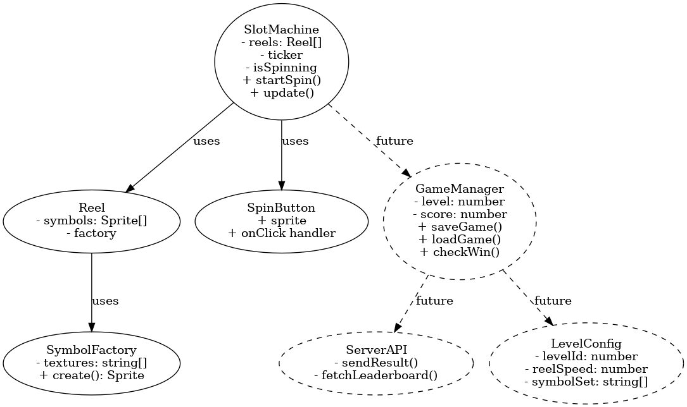

# Poseidon Slot Game 🎰

Poseidon is a simple and engaging slot machine game built with TypeScript and PixiJS. The game provides a browser-based experience with smooth animations and a clean design, ideal for demonstrating game mechanics, animations, and modular structure in a web-based slot game.

## 🧠 Features

- 🎮 Slot machine game logic
- ⚙️ Built with PixiJS for rendering
- 🧩 Modular TypeScript architecture
- 📦 Webpack for bundling
- 📐 Includes UML class diagram for game structure

## 📸 Preview



## 🚀 Getting Started

### Prerequisites

Make sure you have [Node.js](https://nodejs.org/) installed.

### Installation

Clone the repository and install the dependencies:

```bash
npm install
